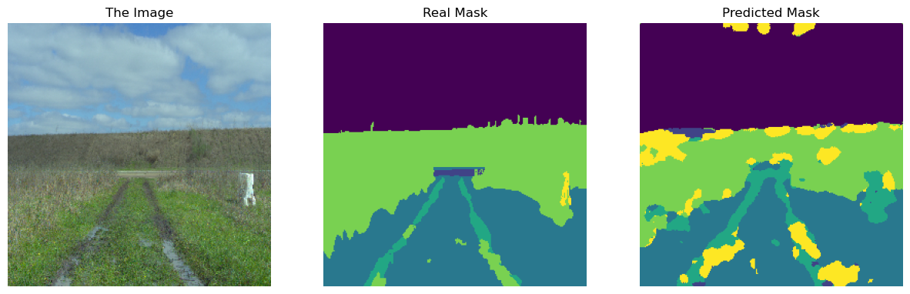

# CNN-Based Terrain Segmentation for Off-Road Autonomy

This project evaluates CNN architectures, SegNet, for pixel-level terrain segmentation in off-road environments. The goal is to classify each pixel in an image into one of six predefined terrain types. Unlike standard datasets, off-road environments present unique challenges like ambiguous boundaries and similar visual features across different terrain types. The study uses the [RELLIS-3D](https://github.com/unmannedlab/RELLIS-3D) dataset [^1] and focuses on a key metric, Mean Intersection over Union (mIoU), to measure performance. The pre-trained ResNet model outperformed the custom SegNet architecture. 

## Methodology and Results

Training is running in M1 pro GPU.

The project implemented one CNN-based methods.

SegNet [^2]: A custom encoder-decoder architecture built from scratch. It uses max-pooling indices for non-linear upsampling in the decoder to recover boundary details. The model was initially prone to overfitting with a deeper architecture (5 encoder/decoder blocks). Overfitting was reduced by simplifying the network to 2 encoder/decoder blocks, which yielded a validation mIoU of ~0.55.

I simplify the structure of the SegNet to let it easier running in my MacBook pro (16GB).

The study found a significant challenge with pixel imbalance between classes in the dataset.

[^1]: The label in the dataset was remark by ourselves. Data label is little unbalence canparing the original dataset.

[^2]: https://arxiv.org/abs/1511.00561